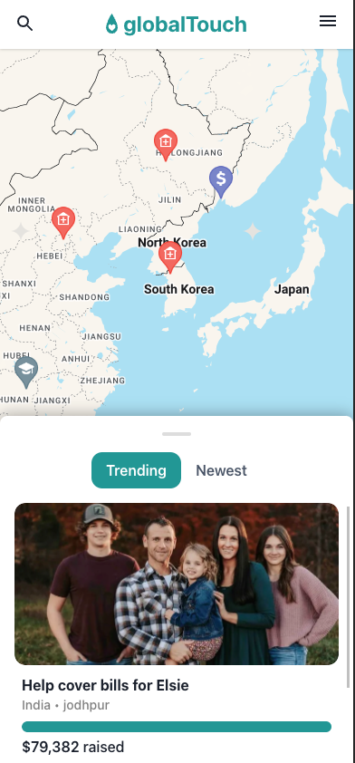
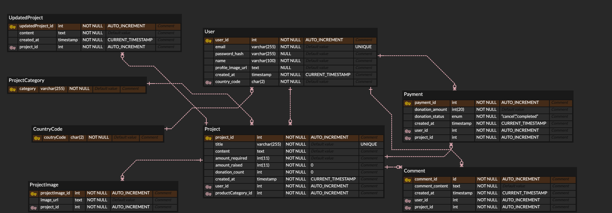

# GlobalTouch 백엔드 프로젝트 소개 🥳

- GlobalTouch는 지도 기반 기부 플랫폼입니다.
- 개인이나 단체가 프로젝트를 생성하고, 다른 사용자들이 해당 프로젝트에 기부할 수 있습니다. gofundme, global giving과 비슷하나 세계 지도 기반으로 사용자에게 어디에 어떤 프로젝트가 있는지 한눈에 볼 수 있습니다.
- 이 프로젝트는 GlobalTouch의 백엔드 부분을 담당하며 Nestjs mono, graphql api로 구성되어 있습니다, 배포는 GCP에 하였습니다.

## 시연 영상 🎥
- [GlobalTouch 시연 영상](https://youtu.be/mIOkJpQ-3s8?si=yXXtemwNp4oN1KKW)
- 

## Figma 디자인 🎨
- [GlobalTouch Figma 디자인](https://www.figma.com/design/Ox761mMCN4pyo54zBv9rUG/globalTouch-beta?node-id=2273-12870&p=f&t=WiYBci88ts3nwuiQ-0)

## 프론트엔드 프로젝트 🌐
- [프론트엔드 프로젝트 깃헙 링크](https://github.com/pcs9898/globaltouch-frontend)

## 제작 기간 📅 && 참여 인원 🧑‍🤝‍🧑
- 2023.10.04 ~ 2023.11.14 (약 6주)
- 1인 개발

## 주요 기능 ✨
- 회원가입 및 로그인 (이메일 로그인, 구글 로그인, jwt access token, refresh token)
- 지도 기반 프로젝트 마커 보여주기 (공간쿼리 사용)
- 기부 프로젝트 CRUD (여러 조건들로 커서 페이징)
- 기부 프로젝트 OG 구현 
- 기부 (결제, 포트원(카카오페이 사용), 트랜잭션 적용)
- 기부 프로젝트 업데이트 CR (기부 받은 돈으로 어떻게 사용했는지 일기 같은 타임라인 개념)
- 기부 프로젝트 검색 기능 (커서 페이징, 카테고리 적용)

## 기술 스택 🧑‍💻
- Nestjs
- Apollo Server
- TypeORM
- JWT
- MySQL
- GCP

## ERD 🗺️
#### 정규화를 최대한 해서 비식별관계만 존재

## API 목록 📃
#### User Module

- [x] feature1/createUser, 회원 가입 API입니다.

- [x] feature5/updateCountryCode (createUserWithGoogle), 구글 로그인 시 국가 코드를 업데이트하는 API입니다.

- [x] feature5.5/fetchUserLoggedIn, 로그인한 유저 정보를 가져오는 API입니다.

- [x] feature6/updateUser (editMyProfile), 유저 정보를 업데이트하는 API입니다.

- [x] feature8.5/fetchUserLoggedInProjects (page-limit:8, sortByTime), 로그인한 유저가 생성한 프로젝트를 가져오는 API입니다. (커서 페이징 적용)

- [x] feature15/fetchUserLoggedInDonations (page-limit:8, sortByTime), 로그인한 유저가 기부한 프로젝트를 가져오는 API입니다. (커서 페이징 적용)

#### Auth Module

- [x] feature2/loginUser, 로그인 API입니다.

- [x] feature3/googleLoginUser, 구글 로그인 API입니다.

- [x] feature4/restoreAccessToken, access token을 복구하는 API입니다.

#### Project Module

- [x] feature7/createProject (picture max 3, transaction), 프로젝트를 생성하는 API입니다. (사진 최대 3장, 트랜잭션 적용)

- [x] feature8/fetchProject, 프로젝트를 가져오는 API입니다.

- [x] feature21/fetchProjectOg, 프로젝트의 OG 정보를 가져오는 API입니다.

- [x] feature9/fetchProjectsTrending (page-limit:8, sortByNumberOfDonations), 인기 있는 프로젝트를 가져오는 API입니다. (커서 페이징 적용)

- [x] feature10/fetchProjectsNewest (page-limit:8, sortByTime), 최신 프로젝트를 가져오는 API입니다. (커서 페이징 적용)

- [x] feature11/fetchProjectsByCountry (page-limit:8, sortByTime), 국가별 프로젝트를 가져오는 API입니다. (커서 페이징 적용)

#### UpdatedProject Module

- [x] feature12/createUpdatedProject, 프로젝트 업데이트 내용을 생성하는 API입니다.

- [x] feature13/fetchUpdatedProjects, 프로젝트 업데이트 내용을 가져오는 API입니다.

#### ProjectDonation Module

- [x] feature14/createProjectDonation (transaction, payment verification), 프로젝트에 기부하는 API입니다. (포트원 카카오페이 사용, 트랜잭션 적용)

#### ProjectComment Module

- [x] feature16/createProjectComment, 프로젝트에 댓글을 생성하는 API입니다.

- [x] feature17/fetchProjectComments (page-limit:10, sortByTime), 프로젝트에 댓글을 가져오는 API입니다.(커서 페이징 적용)

- [x] feature18/updateProjectComment, 프로젝트에 댓글을 업데이트하는 API입니다.

- [x] feature19/deleteProjectComment, 프로젝트에 댓글을 삭제하는 API입니다.

#### Search Module

- [x] feature20/searchProject (searchByCategory, page-limit:8, sortByTime), 프로젝트를 검색하는 API입니다.(커서 페이징 적용, 카테고리 적용)

## 프로젝트 회고 🤔

- Nestjs로 처음 백엔드를 구성해보았는데, 기존에 사용해본 express보다 훨씬 더 구조적이고 편리하다고 느꼈습니다. 특히, 모듈화가 잘 되어있어서 코드의 가독성이 높아졌다고 느꼈습니다.
- 결제 기능을 처음으로 구현해보았는데, 포트원을 사용해서 크게 어려움은 없었지만 모바일과 pc를 별도로 구현해야하는게 조금 어려웠습니다.
- DB 쿼리쪽에서 N+1 문제를 해결하기 위해 DataLoader를 사용해 개선해봐야겠습니다.
- Redis를 사용해 캐싱을 적용해보고 싶습니다.

